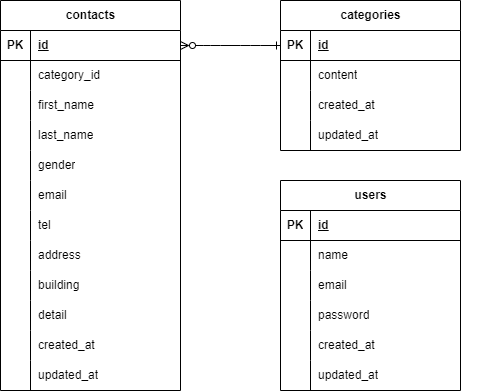

# お問い合わせフォーム

## 環境構築

### Dockerビルド
1. git clone https://github.com/wataru-xxxg/contact-form.git
1. docker-compose up -d --build

### Laravel環境構築
1. docker-compose exec php bash
1. composer install
1. .env.exampleファイルから.envを作成し、環境変数を変更
1. php artisan key:generate
1. php artisan migrate
1. php artisan db:seed

## 使用技術(実行環境)
- PHP 7.4.9
- Laravel 8.83.29
- MYSQL 8.0.26

## ER図

## URL
- 開発環境：http://localhost/
- phpMyAdmin：http://localhost:8080/